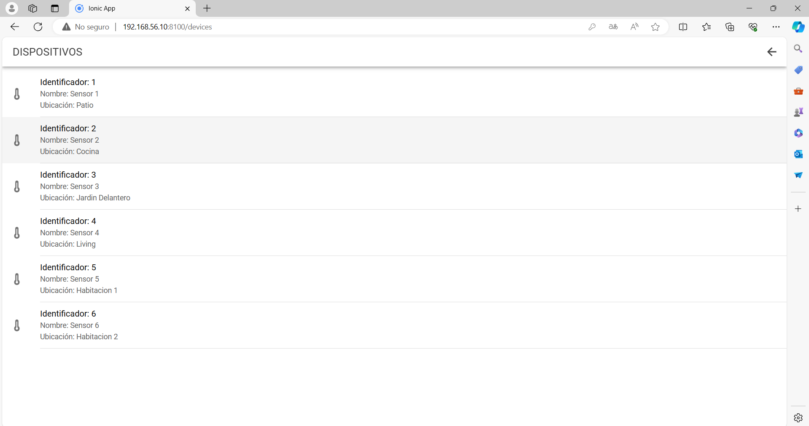
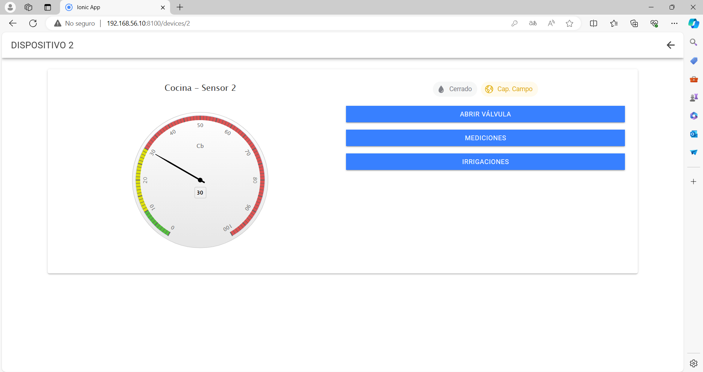

# TP - Desarrollo de aplicaciones multiplataforma

Se realizó la implementación bajo el template app-dam.

## Como ejecutar

En la carpeta app-dam levantar la configuración del contenedor:

``
    cd app-dam
``

``
    docker compose up
``

## Consideraciones

- Credenciales de demo -> user: root, password: root

## Features

La aplicación consta de 6 vistas las cuales se detallan a continuación:

1. Login del sistema mediante usuario y password.

2. El home principal con el botón que redirige a la pestaña de dispositivos. Así como en la parte superior un botón de cierre de sesión.

3. Vista de dispositivos. Se detalla el nombre, la ubicación y el ID.
   

4. Vista de dispositivo, se muestra el tensiómetro. Así como un botón para accionar la válvula (y registra el evento en DB) y dos botones que redirigen a las vistas de mediciones e irrigaciones.
   

5. Vista de mediciones del sensor elegido.
   

6. Vista de irrigaciones del sensor elegido.
   

